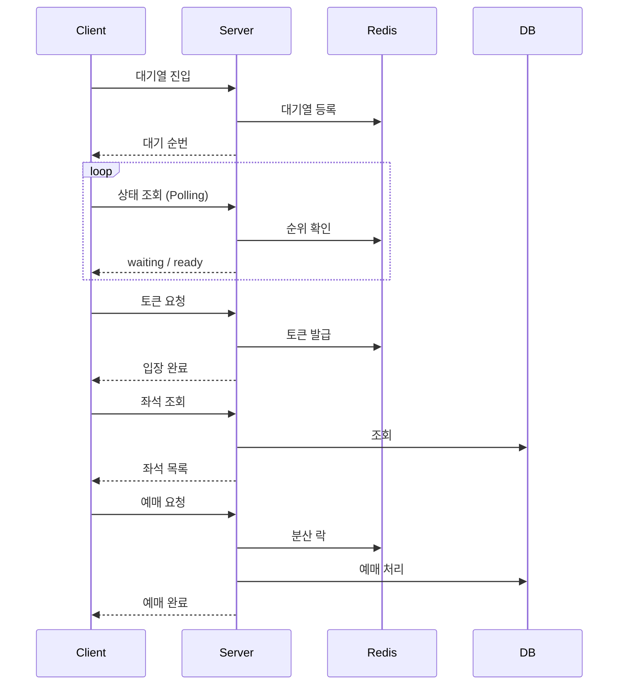

# 선착순 티켓팅 시스템

대용량 트래픽 환경에서 동시성 문제 없이 선착순 좌석 예매를 처리하는 시스템

## 프로젝트 목적

- **동시성 제어**: 분산 락 + DB 락 이중 방어로 Overselling 방지
- **분산 환경**: Stateless 설계로 다중 WAS 운영
- **수평 확장 검증**: 부하 테스트를 통해 스케일아웃 효과 증명

## 기술 스택

- Spring Boot 4.x
- PostgreSQL
- Redis (대기열, 입장 토큰, 분산 락)
- Redisson

## 핵심 기능

- **대기열**: Redis Sorted Set 기반 선착순 대기
- **입장 제어**: 동시 입장 인원 제한으로 DB 보호
- **분산 락**: Redisson으로 좌석 동시 선택 방지

## 예매 흐름 요약

## 문서

| 문서 | 설명 |
|------|------|
| [아키텍처](docs/architecture.md) | 설계 및 기술 선택 근거 |
| [구현 상세](docs/implementation.md) | 상세 흐름, Redis 키 구조 |
| [요구사항](docs/requirements.md) | API 목록, 기능 정의 |
| [한계점 및 개선](docs/limitations.md) | 시스템 한계점, 개선 방안 |
| [부하 테스트 결과](docs/load-test-results.md) | 수평 확장 효과 검증, Overselling 방지 검증 |
