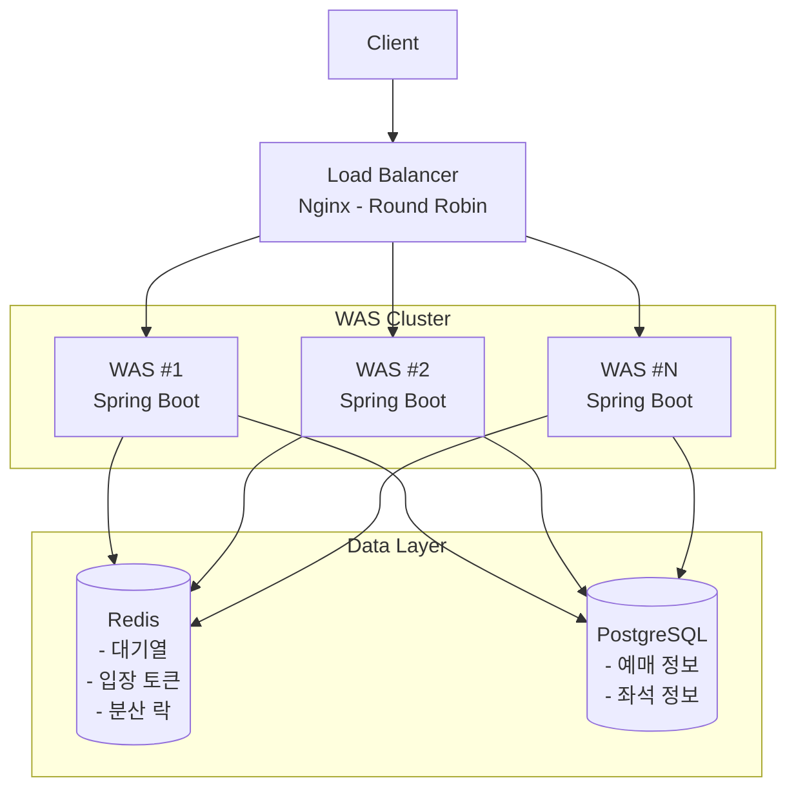
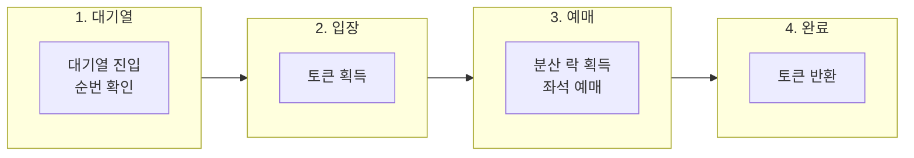

# 선착순 티켓팅 시스템 아키텍처

## 개요

대용량 트래픽 환경에서 동시성 문제 없이 선착순 좌석 예매를 처리하는 시스템.

### 핵심 목표
- **Overselling 방지**: 100석인데 101명이 예매되는 상황 차단
- **DB 보호**: 트래픽 폭주 시에도 DB가 죽지 않도록 제어

---

## 기술 스택

| 구분 | 기술 | 선택 이유 |
|------|------|-----------|
| **Backend** | Spring Boot 4.x | 국내 채용 시장 주류, 검증된 생태계 |
| **Database** | PostgreSQL | ACID 보장, 좌석 예매의 정합성 필수 |
| **Cache/Queue** | Redis | 대기열, 잔여 좌석 캐시, 분산 락, 입장 토큰 |
| **분산 락** | Redisson | Redis 기반 분산 락 구현체, Pub/Sub 방식 |

---

## 시스템 아키텍처

---

## 핵심 설계

### 1. 대기열 시스템

**Redis Sorted Set 사용**

대기열의 핵심 요구사항: 사용자가 "내 앞에 몇 명?" 조회 가능해야 함

| 연산 | Redis List | Redis Sorted Set |
|------|------------|------------------|
| 삽입 | O(1) 양 끝만 | O(log N) |
| 인덱스 조회 | O(N) 순회 필요 | O(log N) |
| **내 순위 조회** | O(N) 전체 순회 | O(log N) |

10만 명 대기열 기준:
- List: 매 요청마다 최대 10만 번 순회
- Sorted Set: ~17번 비교로 순위 조회 완료

**왜 MQ(RabbitMQ, Kafka)가 아닌가?**

| 방식 | 순서 보장 | 내 순번 조회 | 적합성 |
|------|----------|-------------|--------|
| **RabbitMQ** | X (multi consumer 시) | X (불가능) | X |
| **Kafka** | O (파티션 내) | X (실시간 어려움) | X |
| **Redis Sorted Set** | O (score 기준) | O | **O** |

- RabbitMQ: Consumer가 메시지를 꺼내가는 구조 → 대기자가 자기 순번 알 수 없음
- Kafka: 파티션 내 순서 보장되지만, 파티션 간 순서 보장 X. 실시간 순위 조회용이 아닌 이벤트 스트리밍 용도

---

### 2. 입장 제어

**토큰 버킷 방식**

- 동시 입장 인원을 N명으로 제한 (DB 처리량 기준)
- 토큰 획득 시 입장, 실패 시 대기
- 토큰 TTL + Polling 시 갱신으로 이탈 자동 처리

**입장 순서**

- 대기열 순번대로 입장
- 빈 자리가 생기면 다음 순번이 입장 가능
- 내 순번 < 남은 자리 수 → 입장 가능 (ready)

---

### 3. 잔여 좌석 관리

**Redis로 잔여 좌석 수 캐싱**

- DB 조회 없이 빠른 잔여 확인
- 원자적 감소로 동시성 제어
- 잔여 0 이하면 즉시 "매진" 응답

**정합성**
- Redis 값과 DB 실제 값이 불일치할 수 있음
- 예매 확정 시 DB 기준으로 최종 검증

---

### 4. 분산 락

**왜 분산 락이 필요한가?**

WAS가 여러 대일 때, 같은 좌석에 동시 요청이 들어오면:
- DB Lock만으로는 성능 저하 (DB 커넥션 점유)
- Application 레벨에서 먼저 제어 필요

**Redisson 선택 이유**

| 방식 | 문제점 |
|------|--------|
| `SETNX` + TTL | 락 해제 전 서버 죽으면 TTL까지 대기 |
| Redisson | Pub/Sub 방식으로 즉시 락 획득 통지 |

**락 범위**: 좌석 단위 → 다른 좌석은 병렬 처리 가능

---

### 5. 예매 흐름

---

## 트레이드오프 & 의사결정

### 1. 대기열 알림 방식

| 방식 | 장점 | 단점 |
|------|------|------|
| **WebSocket** | 실시간 양방향 | Stateful, 연결 상태 관리 필요, 장애 시 재연결 폭탄 |
| **SSE** | 단방향 실시간 | Stateful, 연결 유지 필요 |
| **Polling** | Stateless, 장애 복구 용이, Scale out 용이 | 불필요한 요청 발생 |

**선택: Polling**

- **Stateless**: 서버가 클라이언트 상태를 유지하지 않음 → 서버 추가만으로 Scale out
- **장애 복구**: 서버 장애 시 다음 요청이 다른 서버로 자연스럽게 라우팅
- **리소스 효율**: 대기 시간이 긴 경우, 연결 유지보다 주기적 요청이 효율적일 수 있음
- 인터파크, 멜론티켓 등 대형 티켓팅 서비스에서 검증된 방식

### 2. Redis vs DB Lock

| 방식 | 문제점 |
|------|--------|
| DB Pessimistic Lock | 락 대기 중 DB 커넥션 점유, 데드락 위험 |
| DB Optimistic Lock | 충돌 시 재시도 필요, 트래픽 폭주 시 재시도 폭탄 |
| Redis 분산 락 | Redis 장애 시 대응 필요 |

**선택: Redis 분산 락 (Redisson)**

- DB는 이미 예매 데이터 저장으로 부하 → 락 처리까지 맡기면 병목
- Redis로 락 처리 분리 → DB 부하 감소
- 락 대기가 DB 커넥션을 점유하지 않음
